<!--
      Typing SVG https://github.com/denvercoder1/readme-typing-svg
      Readme Stats : https://github.com/anuraghazra/github-readme-stats
      Snake thing : https://github.com/danielbped/ 
-->

<h1 align="center">Hi, I'm Aline Klauck! (ﾉ◕ヮ◕)ﾉ*:･ﾟ✧</h1>

  

  

 

- 🎓 ***Complete*** Technology in System and Analysis Development **|** ***Coursing*** Software Engineering

- 🌸 Fun fact **I use silly names for variables when learning so I can't just copy paste the teacher's code**

- ✉ How to reach me: klauckac@gmail.com

- 👋 Say hi to me in my **<a href="https://br.linkedin.com/in/alineklauck" target="_blank">LinkedIn!</a>**

- 🤯 Wanna see my cv / resume??! Here, **<a href="https://www.canva.com/design/DAFfKSe0m5Q/aEqyFjRKtF_XbXiYy7wHFw/view?utm_content=DAFfKSe0m5Q&utm_campaign=designshare&utm_medium=link&utm_source=publishsharelink" target="_blank">take a look</a>** !!

 

<h3>─── ❖ ── Wow! Look at those stats! ── ❖ ───</h3>
 

 
 

 

<h3>─── ❖ ── My faves ── ❖ ───</h3>

 
 
 
<h3> Thank you for reading! </h3>

